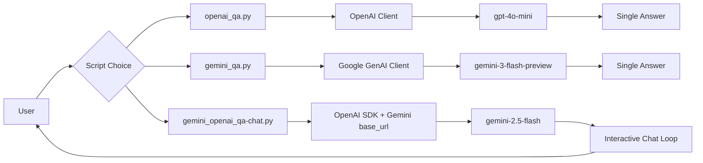

# 01 - Chatbot

This project introduces foundational chatbot patterns using OpenAI and Google Gemini models. It contains three simple scripts that demonstrate single-turn Q&A and multi-turn chat behavior, including Gemini access through the OpenAI-compatible API format.

## Problem Statement

When starting with LLM applications, many learners struggle with three practical questions:

- How to send a basic prompt to a model and read the answer.
- How API usage differs across model providers.
- How to move from one-shot Q&A to an interactive chat loop.

Without a minimal hands-on reference, it is hard to understand prompt structure, model selection, environment-based key management, and provider interoperability.

## Goal

The goals of this project are:

- Build the simplest possible LLM Q&A examples with working code.
- Compare OpenAI-native and Gemini-native client usage.
- Demonstrate a multi-turn CLI chatbot loop.
- Show how Gemini can be called through an OpenAI-style interface (`base_url` approach).

## Project Processing Detail

The project includes three scripts:

1. [openai_qa.py](openai_qa.py)
- Loads environment variables with `python-dotenv`.
- Creates an OpenAI client.
- Sends a single input prompt to `gpt-4o-mini` using the Responses API.
- Prints one final text output.

2. [gemini_qa.py](gemini_qa.py)
- Loads environment variables with `python-dotenv`.
- Creates a Google GenAI client using `GEMINI_API_KEY`.
- Sends a single input prompt to `gemini-3-flash-preview`.
- Prints one final text output.

3. [gemini_openai_qa-chat.py](gemini_openai_qa-chat.py)
- Loads environment variables with `python-dotenv`.
- Initializes OpenAI SDK with Gemini API key and Google OpenAI-compatible `base_url`.
- Defines a system prompt to control response style.
- Runs an infinite `while` loop:
- Accepts user input from terminal.
- Sends system + user messages to `gemini-2.5-flash` via Chat Completions format.
- Prints assistant response.

## Architecture Diagram



## Tech Stack

- Language: Python 3.x
- Environment management: `python-dotenv`
- OpenAI integration: `openai` SDK
- Gemini integration (native): `google-genai`
- Gemini integration (OpenAI-compatible): OpenAI Chat Completions format + Google OpenAI-compatible endpoint
- Interface type: Command-line interface (CLI)

## Environment Variables

Configure a `.env` file with keys used by the scripts:

```env
OPENAI_API_KEY=your_openai_key
GEMINI_API_KEY=your_gemini_key
```

Notes:

- [openai_qa.py](openai_qa.py) uses `OPENAI_API_KEY`.
- [gemini_qa.py](gemini_qa.py) uses `GEMINI_API_KEY`.
- [gemini_openai_qa-chat.py](gemini_openai_qa-chat.py) uses `GEMINI_API_KEY` with OpenAI SDK + custom `base_url`.

## How to Run

1. Install required packages.
2. Create `.env` with the API keys.
3. Run one of the scripts:

```bash
python openai_qa.py
python gemini_qa.py
python gemini_openai_qa-chat.py
```

## Current Limitations

- No conversation memory persistence.
- No error handling/retry logic for rate limits or network failures.
- No token usage/cost logging.
- Prompting and model parameters are mostly hardcoded.
