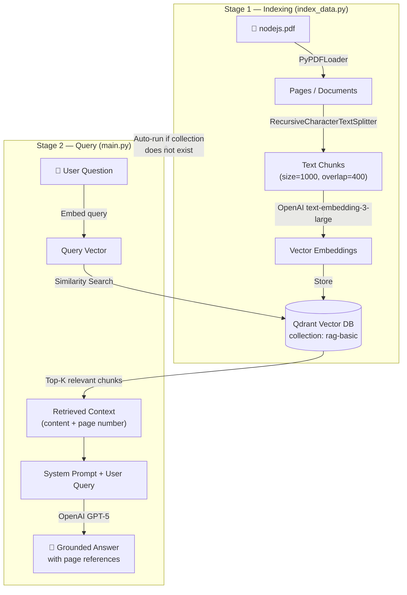

# 02 - RAG Basic: PDF Question & Answer System

## Problem Statement

Large Language Models (LLMs) are powerful but limited to their training data — they cannot answer questions about private, domain-specific, or recently updated documents. When a user asks a question about the contents of a specific PDF (e.g., a Node.js reference book), a vanilla LLM will either hallucinate or refuse to answer.

**How can we enable an LLM to accurately answer questions grounded in the content of a specific PDF document?**

## Goal

Build a Retrieval-Augmented Generation (RAG) pipeline that:

1. Ingests a PDF document, splits it into chunks, and stores vector embeddings in a vector database.
2. At query time, retrieves the most relevant chunks for the user's question.
3. Feeds the retrieved context to an LLM to generate a grounded, accurate answer with page number references.

## Project Processing Detail

The project consists of two stages:

### Stage 1 — Indexing (`index_data.py`)

1. **Load PDF** — `PyPDFLoader` reads `nodejs.pdf` and extracts text page-by-page, preserving metadata (page number, source file).
2. **Chunk** — `RecursiveCharacterTextSplitter` splits the document into overlapping chunks (`chunk_size=1000`, `chunk_overlap=400`) so that no important context is cut at a boundary.
3. **Embed** — Each chunk is converted to a high-dimensional vector using the OpenAI `text-embedding-3-large` model.
4. **Store** — The embeddings and their metadata are stored in a **Qdrant** vector database (collection: `rag-basic`).

### Stage 2 — Query (`main.py`)

1. **Collection check** — On startup, the script connects to Qdrant and verifies whether the `rag-basic` collection exists. If not, it automatically runs `index_data.py` to complete indexing first.
2. **User input** — The user types a natural-language question.
3. **Similarity search** — The question is embedded with the same model and Qdrant returns the top-matching chunks.
4. **Prompt construction** — A system prompt is built containing the retrieved context (page content + page number + file location).
5. **LLM generation** — The prompt and user query are sent to **GPT-5**. The model is instructed to answer only from the provided context and reference page numbers.
6. **Response** — The answer is printed to the console.

## Architecture Diagram

## Tech Stack

| Component | Technology |
|---|---|
| Language | Python |
| LLM | OpenAI GPT-5 |
| Embedding Model | OpenAI `text-embedding-3-large` |
| Vector Database | Qdrant (Docker) |
| PDF Loading | LangChain `PyPDFLoader` |
| Text Splitting | LangChain `RecursiveCharacterTextSplitter` |
| Vector Store Integration | `langchain-qdrant` |
| Environment Variables | `python-dotenv` |
| Orchestration | Docker Compose |