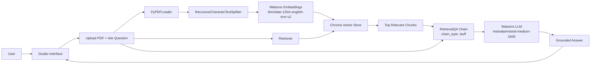

# 03 - Gradio RAG Chatbot

An interactive Retrieval-Augmented Generation (RAG) chatbot where users upload a PDF and ask natural-language questions. The application retrieves relevant chunks from the uploaded document and uses an IBM watsonx LLM to generate grounded answers.

## Problem Statement

Large language models can produce fluent responses, but they often lack access to private, document-specific knowledge at inference time. In many real scenarios (course notes, policies, manuals, reports), users need answers that come directly from an uploaded document rather than from the model's pretraining.

This project solves that gap by building a lightweight RAG workflow that:

- Accepts a user PDF at runtime.
- Converts document content into vector embeddings.
- Retrieves semantically relevant chunks for each question.
- Generates answers using retrieved context.

## Goal

The primary goals of this project are:

- Build a minimal end-to-end RAG chatbot with a friendly web interface.
- Demonstrate document-grounded Q&A using IBM watsonx models and LangChain.
- Show the full RAG lifecycle: ingestion, chunking, embedding, indexing, retrieval, and answer generation.
- Keep the workflow simple enough for learning and extension.

## Project Processing Detail

The core flow is implemented in [qabot.py](qabot.py).

1. Environment setup
- Loads secrets from `.env` using `python-dotenv`.
- Uses `WATSONX_API_KEY` and `IBM_PROJECT_ID` for watsonx authentication.

2. User input via Gradio UI
- User uploads one PDF file.
- User submits a free-text question.

3. Document loading
- `PyPDFLoader` reads the uploaded PDF and converts it into LangChain document objects.

4. Text chunking
- `RecursiveCharacterTextSplitter` splits the document into chunks:
- `chunk_size=1000`
- `chunk_overlap=50`

5. Embedding generation
- `WatsonxEmbeddings` (`ibm/slate-125m-english-rtrvr-v2`) creates vector embeddings for each chunk.

6. Vector indexing
- Chunks and embeddings are stored in a local in-memory Chroma vector store for retrieval.

7. Retrieval step
- Chroma retriever performs similarity search against the indexed chunks based on the user query.

8. Answer generation
- `RetrievalQA` chain (`chain_type="stuff"`) sends retrieved context + query to `WatsonxLLM` (`mistralai/mistral-medium-2505`).
- Returns a final natural-language answer to the Gradio output box.

9. App serving
- Gradio launches on `localhost:7860` with public sharing enabled (`share=True`).

## Architecture Diagram



## Tech Stack

- Language: Python 3.x
- UI: Gradio
- LLM inference: IBM watsonx (`langchain-ibm`, `ibm_watsonx_ai`)
- Embeddings: `ibm/slate-125m-english-rtrvr-v2`
- Orchestration: LangChain (`langchain-classic`, `langchain-community`)
- Document parsing: `PyPDFLoader` (`pypdf`)
- Vector database: ChromaDB
- Config & secrets: `python-dotenv`

## How to Run

1. Install dependencies:

```bash
pip install -r requirements.txt
```

2. Create a `.env` file in this folder with:

```env
WATSONX_API_KEY=your_api_key
IBM_PROJECT_ID=your_project_id
```

3. Start the app:

```bash
python qabot.py
```

4. Open the Gradio URL shown in terminal (default: `http://localhost:7860`), upload a PDF, and ask questions.

## Current Limitations

- Index is rebuilt per run and per uploaded file; no persistent storage.
- No citation/page-source display in output.
- Single-file, single-session workflow.
- No conversation memory across turns.

## Suggested Improvements

- Add source citations and page references in final answers.
- Persist vector store to disk for faster repeated queries.
- Add configurable retrieval options (`k`, score threshold, re-ranking).
- Support multi-document ingestion and session history.
